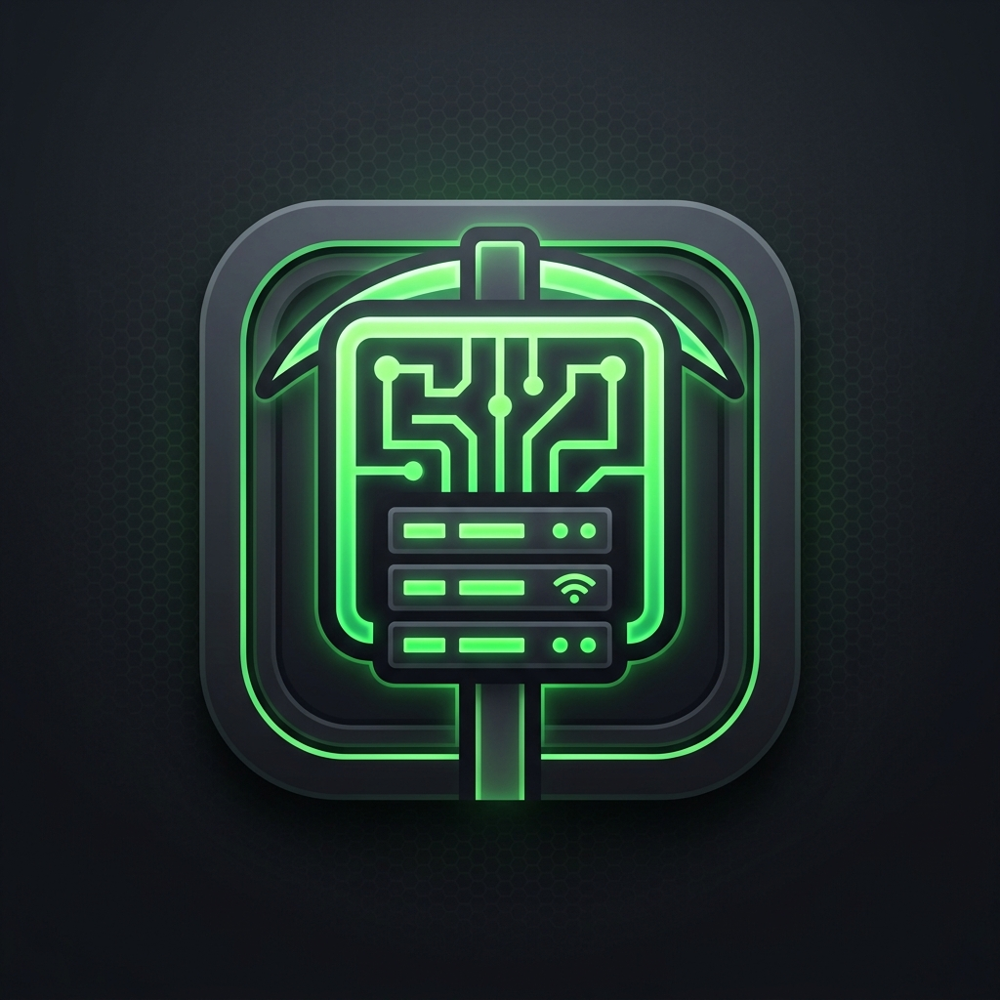

  
  
  # Minecraft Admin Panel
  **Современная утилита для администрирования серверов Minecraft**
  
  
  
  

---

**Minecraft Admin Panel** — это мощная и красивая десктопная утилита для автоматизации задач администратора сервера Minecraft. Написана на Python с использованием современного фреймворка **Flet** (основанного на Flutter), обеспечивающего невероятно плавный, быстрый и отзывчивый интерфейс.

## 🚀 Особенности
- **Интеграция с серверами:** Автоматическое подключение по SFTP и синхронизация модов (удаление старых, загрузка новых) в один клик.
- **RCON Консоль:** Прямое управление сервером через красивую RCON-консоль. Поддержка истории команд, быстрого ввода и подсветки синтаксиса логов.
- **Модуль Бекапов:** Создание локальных архивов (через 7-Zip) с возможностью исключения ненужных папок (например, `world` или `logs`).
- **Сверхкомпактная сборка:** Готовые бинарные файлы (EXE для Windows и бинарник для Linux) максимально сжаты с помощью UPX для экономии места.
- **Современный UI:** Темная тема (Dark Mode), неоновые акценты, скругленные углы и плавная анимация переходов.
- **Встроенный автообновлятор:** Приложение само проверяет новые версии на GitHub и предлагает обновиться без перезахода на сайт.

## 📥 Установка и запуск

Перейдите на страницу [Releases](https://github.com/milkycloud-dev/admin-panel-minecraft/releases) и скачайте последнюю версию для вашей операционной системы. 
Программа поставляется в виде одного переносимого файла (Portable), установка не требуется!

## ⚙️ Технологии
- **Python 3.11+**
- **Flet** (Современный UI Framework)
- **Paramiko** (SFTP/SSH интеграция)
- **PyInstaller & UPX** (Сборка и сжатие релизов)

---

  <i>Разработано с ❤️ для администраторов серверов Minecraft.</i>

